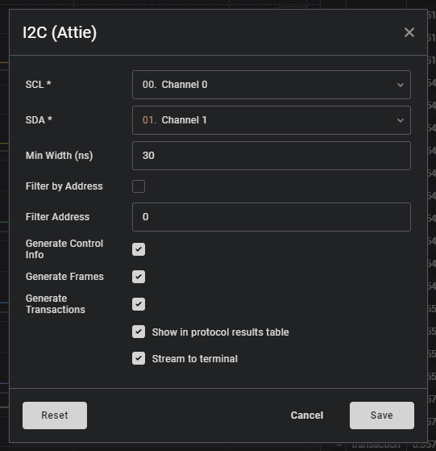
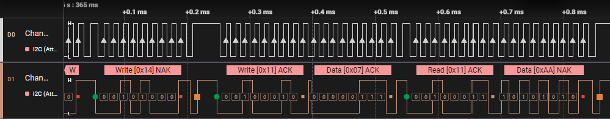
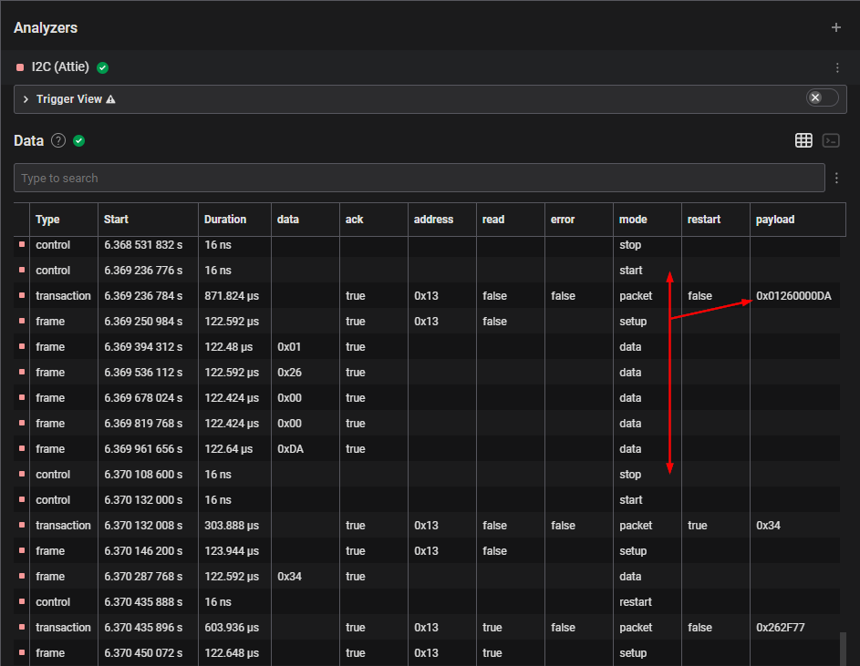
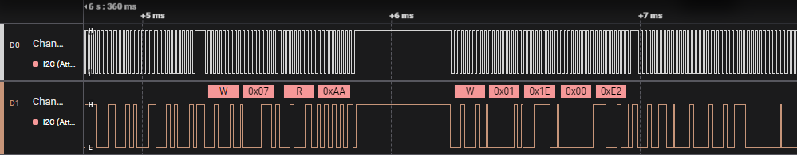
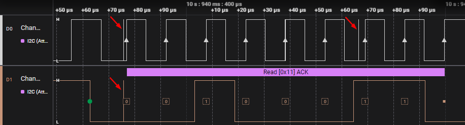

# I<sup>2</sup>C Protocol Analyzer for Saleae Logic 2

This analyzer will decode I<sup>2</sup>C, with a handful of benefits over the bundled I<sup>2</sup>C analyzer.

## Settings

Decode in confidence, with the ability to configure a built-in glitch filter, and granular control over what data appears in the results table.



## Edge-by-Edge Visibility

The analyzer operates in clear view, showing you the decision it made at each point of the signal - great for learning or identifying where something went wrong.



## Tabular Data

Data is decoded into three categories - Control, Frame and Transaction... each can be independently enabled and disabled.

- "_Control_" includes the start, restart, stop and error conditions
- "_Frame_" is a per-frame decode, indicating the address or data value
- "_Transaction_" is a per-transaction decode, including the full binary payload



## Filter by Address

For the more busy busses, filtering based on the target address will provide instant visibility on when the device is active.
The edge-by-edge details are still visible for everything, but bubbles and table data will only be produced according to the target address you specify.



## Glitch Filtering

Robust built-in glitch filtering helps to provide valid decodes, even when your data isn't perfect.
In this screenshot there are actually three 8ns glitches in the clock signal, but the decode is still correct.




# Build and Install

See: [`i2c-analyzer`](https://github.com/saleae/i2c-analyzer)

Go to: Edit -> Settings -> Custom Low Level Analyzers

## Linux

```bash
cmake -S . -B build
make -C build
```

See: `./build/Analyzers/*.so`

## Windows

- Install Visual Studio 2019 Community
- Install CMake
- Install git

```cmd.exe
cmake -S . -B build
cmake --build build --config Release
```

See: `./build/Analyzers/Debug/*.dll`
